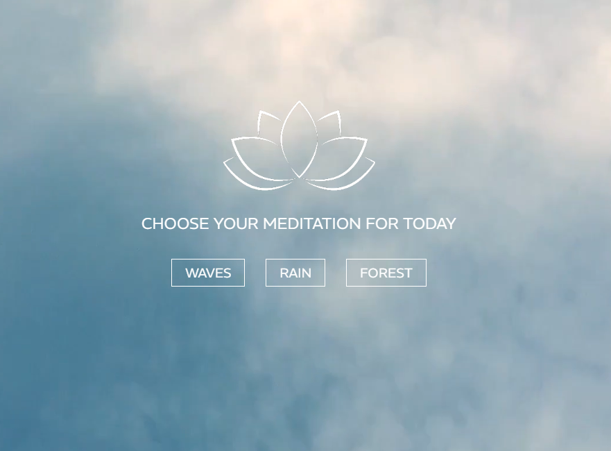
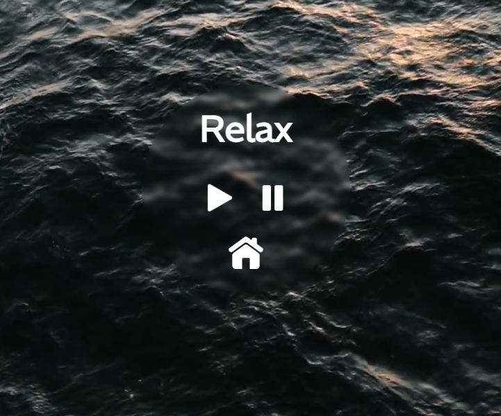
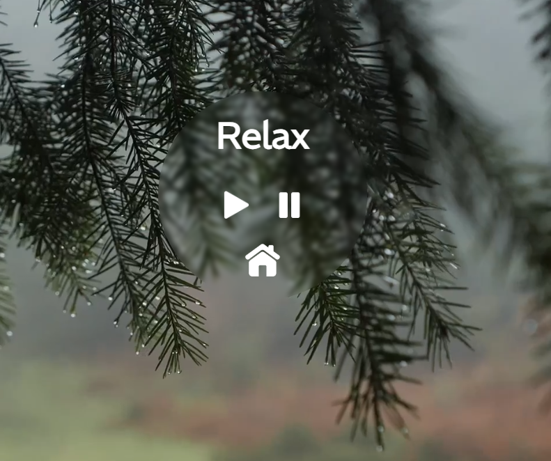
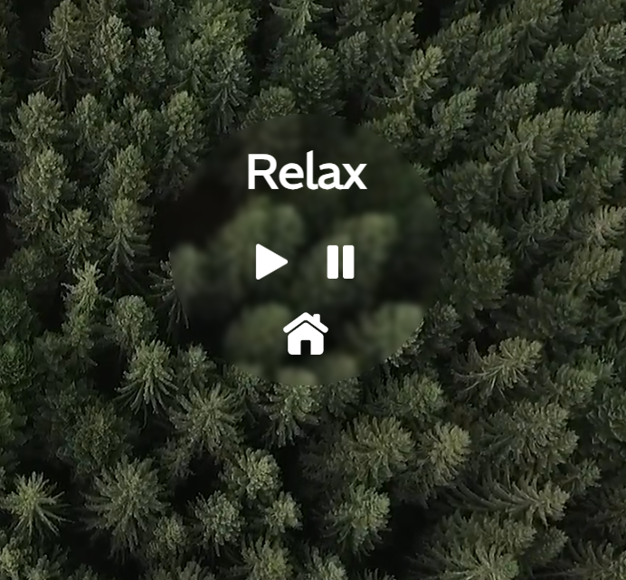

# Meditation App

**Meditation App** is a web application designed to help you relax and de-stress by offering three meditation options: ocean waves, rain sounds, and forest ambiance. Each meditation session lasts five minutes and is accompanied by soothing audio and matching visuals.

## Features

- **Meditation selection** — choose from three options: ocean waves, rain sounds, or forest ambiance.
- **5-minute timer** — meditation automatically ends after five minutes.
- **Audio and video support** — each meditation includes corresponding audio and visual backgrounds for full immersion.

## Technologies Used

- **JavaScript** — handles the app’s functionality and timer control.
- **HTML/CSS** — provides the basic structure and styling for the application.
- **Audio/Video files** — for sound and visual ambiance during meditations.

## Installation and Setup

1. Clone the repository:
    ```bash
    git clone https://github.com/OksanaNova/meditation-app.git
    ```
2. Navigate to the project directory:
    ```bash
    cd meditation-app
    ```
3. Open `index.html` in your browser to launch the app.

## Screenshots






## Project Purpose

This project was created as a learning exercise to practice working with multimedia and timers in JavaScript. The app is intended for educational and entertainment purposes.

## Support

For questions or suggestions, feel free to open an issue in this repository or reach out via email: `o.nova0804@gmail.com`.


